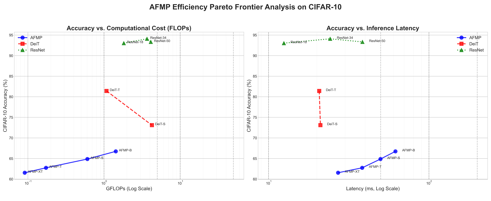
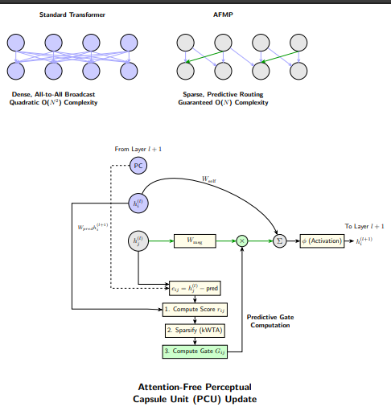
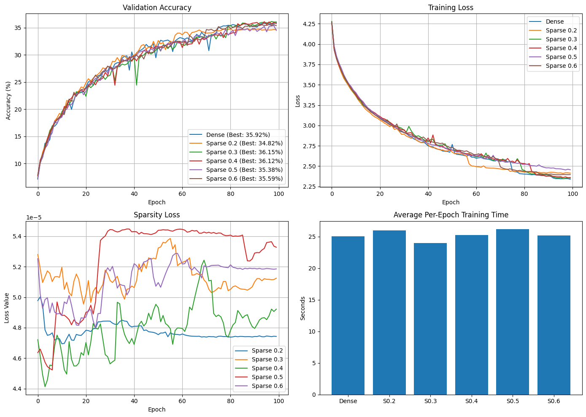
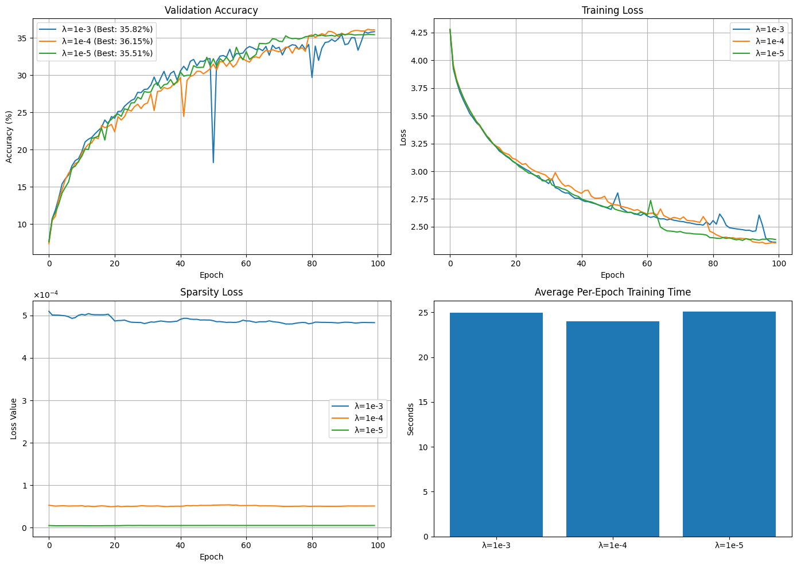
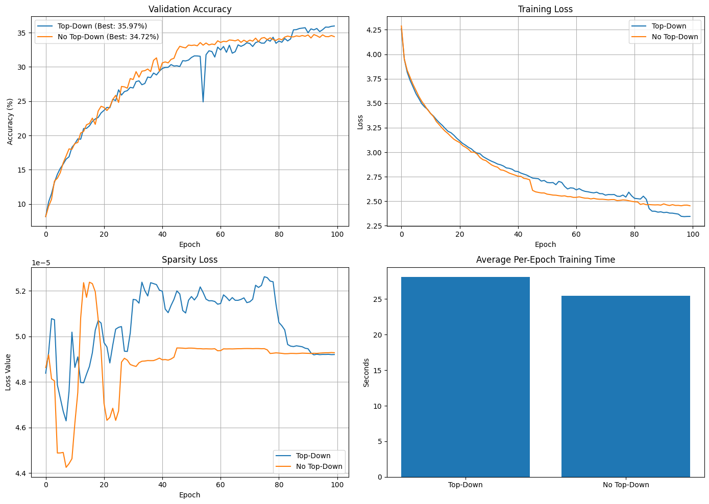

# Beyond-Attention-Linear-Time-Modular-Perception-and-the-Latency-FLOPs-Dichotomy

This repository contains the official PyTorch implementation for the paper **"Beyond Attention: Linear-Time Modular Perception and the Latency-FLOPs Dichotomy"**. Our work introduces a novel, scalable neural network architecture called **Attention-Free Modular Perception (AFMP)** and uncovers a critical disconnect between theoretical compute (FLOPs) and real-world latency on modern hardware.

---

## Abstract

Dense self-attention, the cornerstone of modern neural networks, faces a fundamental scaling problem due to its quadratic complexity. This work confronts this challenge on two fronts: architectural and methodological. Architecturally, we introduce Attention-Free Modular Perception (AFMP), a framework built on neuro-inspired principles of predictive coding and sparse, error-driven routing to achieve guaranteed linear complexity. Methodologically, by benchmarking AFMP, we uncover and formalize the **Latency-FLOPs Dichotomy**—a critical disconnect between theoretical compute and real-world latency on modern hardware. Our work provides definitive proof of AFMP's linear scaling advantages and argues that the future of efficient AI is inseparable from hardware-software co-design.

---

## Core Contributions

### 1. The Latency-FLOPs Dichotomy
Our central finding is the **Latency-FLOPs Dichotomy**, which reveals that FLOPs are an insufficient and often misleading metric for evaluating the efficiency of sparse, next-generation architectures. While AFMP is algorithmically superior in FLOPs, its sparse, memory-bound operations are penalized by hardware optimized for dense matrix multiplication. This underscores the urgent need for hardware-software co-design.

The Pareto frontier analysis on CIFAR-10 (Figure 3) clearly illustrates this disconnect. In the left panel (FLOPs), AFMP models are competitive. In the right panel (Latency), they exhibit a disproportionate increase in inference time, revealing the hardware's bias towards dense computations.

_Figure 3: Pareto frontier analysis of AFMP efficiency on CIFAR-10, demonstrating the Latency-FLOPs Dichotomy._ 
  

---

### 2. Attention-Free Modular Perception (AFMP)
We introduce AFMP, a new class of architectures designed from first principles for linear scalability. Instead of the dense, all-to-all broadcast of self-attention, AFMP uses a sparse, error-driven predictive routing mechanism inspired by computational neuroscience.

**Key Principles:**
- **Modular Specialization:** Semi-autonomous Perceptual Capsules process localized information.
- **Error-Driven Sparse Routing:** Communication is dynamic and selective, guided by prediction errors.
- **Guaranteed O(N) Complexity:** Achieved via a pre-computed static graph with dynamic gating.

_Figure 1: Comparison of a Standard Transformer's dense attention with AFMP's sparse predictive routing._

  

---

### 3. Definitive Proof of Linear O(N) Scaling
We provide empirical evidence of AFMP's linear scalability in both memory and computation, directly contrasting it with the quadratic O(N²) bottleneck of standard Vision Transformer (ViT) models like DeiT. Our analysis across multiple model scales shows that AFMP overcomes the "memory wall" that fundamentally limits Transformers on high-resolution inputs.

_Figure 2: Scalability comparison of AFMP vs. DeiT. AFMP shows linear O(N) scaling in both memory (left) and time (right), while DeiT exhibits quadratic O(N²) scaling._

  

---

### 4. Ablation Studies: The Importance of Sparsity and Hierarchy
Our paper includes comprehensive ablation studies to validate AFMP's design principles.

- **Learned Sparsity as a Regularizer:** We discovered a "regularization sweet spot," where enforcing a moderate level of sparsity (30-40%) improves generalization by preventing overfitting, without creating an information bottleneck.

_Figure 4: Analysis of learned sparsity, showing an optimal accuracy regime (top-left) and the regularizing effect on training loss (top-right)._

  

- **Sensitivity to Regularization Strength:** We demonstrate that performance is sensitive to the sparsity coefficient (λ), highlighting the need for a well-tuned balance between physical connectivity and optimization pressure.

_Figure 5: Sensitivity analysis of the sparsity regularization coefficient, showing a clear performance peak at λ = 1e-4._

  

- **Hierarchical Top-Down Refinement:** Our final ablation study proves the value of the hierarchical refinement pass, a key architectural component that allows higher-level representations to correct and refine lower-level capsule states, leading to a significant accuracy gain.

_Figure 6: Ablation of the hierarchical top-down refinement pass, demonstrating a clear performance improvement from the mechanism._

  

---

Please see the individual notebooks for setup and execution instructions.

---

## Citation

It will be updated upon acceptance. Thankyou

